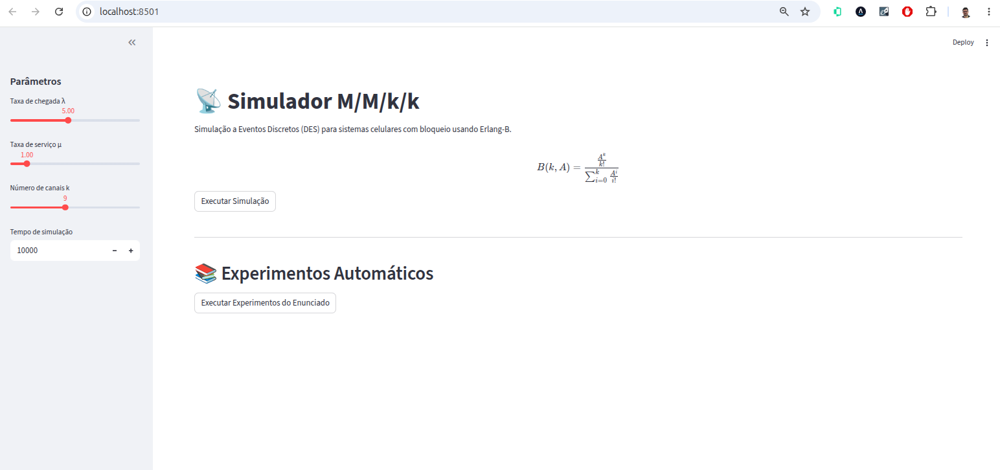
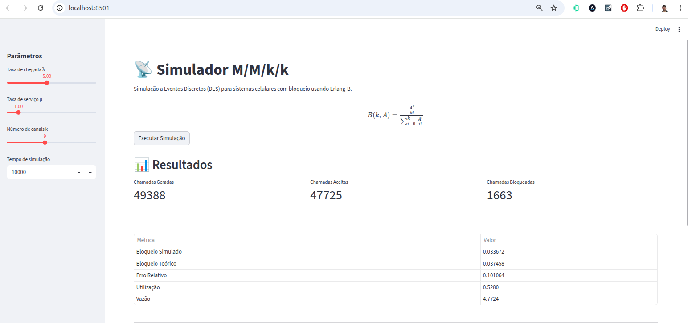
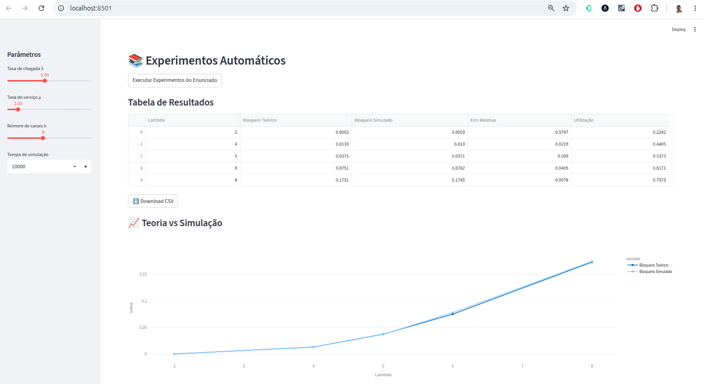
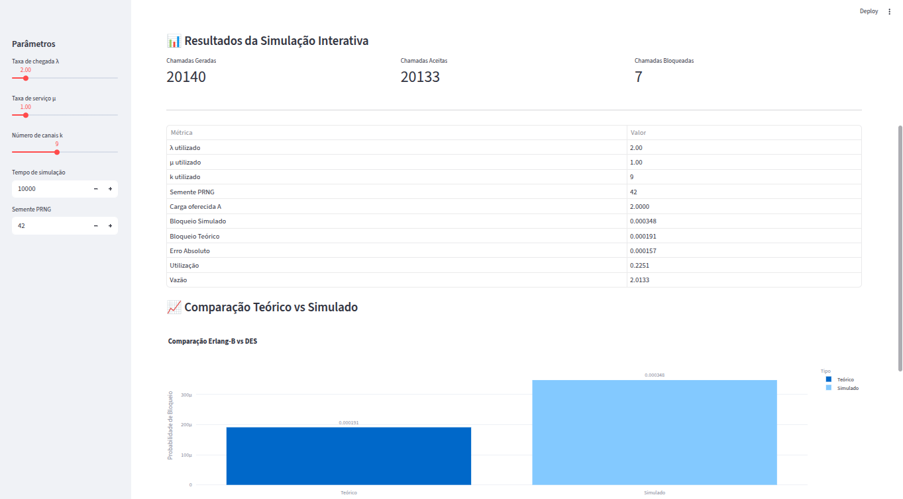
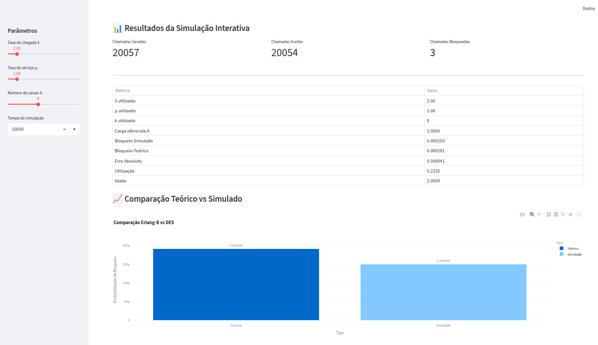
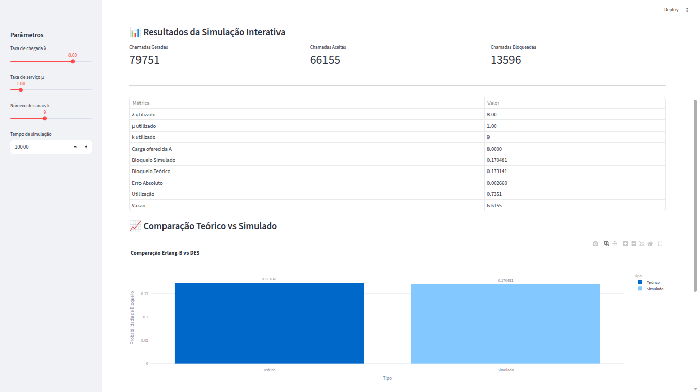

# 📡 Simulador M/M/k/k com DES e Erlang-B

Projeto desenvolvido para a disciplina de **Avaliação de Desempenho de Sistemas (ADS)** do curso de Engenharia de Telecomunicações do IFSC.

O sistema implementa uma **Simulação a Eventos Discretos (DES)** de um sistema celular do tipo **M/M/k/k**, comparando os resultados simulados com os resultados teóricos obtidos pela fórmula de **Erlang-B**.

---

# 🎯 Objetivos

O projeto simula:

- chegadas de chamadas segundo processo de Poisson;
- duração das chamadas com distribuição exponencial;
- múltiplos canais de comunicação;
- bloqueio imediato de chamadas quando todos os canais estão ocupados;
- cálculo de métricas de desempenho;
- comparação entre teoria e simulação.

---

# 🧠 Modelo M/M/k/k

Características do sistema:

| Característica | Descrição |
|---|---|
| M | Chegadas Poisson |
| M | Serviço exponencial |
| k | Número de canais |
| k | Capacidade máxima do sistema |
| Fila | Não possui |
| Bloqueio | Imediato |

---

# 📚 Fórmula de Erlang-B

A probabilidade teórica de bloqueio é dada por:

$$
B(k,A)=
\frac{
\frac{A^k}{k!}
}{
\sum_{i=0}^{k}
\frac{A^i}{i!}
}
$$

onde:

$$
A = \frac{\lambda}{\mu}
$$

---

# 🛠 Tecnologias Utilizadas

- Python 3
- Streamlit
- Plotly
- Pandas
- NumPy

---

# 📁 Estrutura do Projeto

```text
a3.1/
│
├── app.py
├── simulator.py
├── events.py
├── erlang.py
├── metrics.py
├── experiment.py
├── plot_results.py
├── requirements.txt
├── imagens/
├── results/
└── README.md
```

---

# ⚙️ Instalação

## 1. Clonar o repositório

```bash
git clone https://github.com/wagnerfloresdossantos/engtelecom-ifsc-sj.git
```

---

## 2. Entrar na pasta do projeto

```bash
cd engtelecom-ifsc-sj/ads-2026.1/a3.1
```

---

## 3. Criar ambiente virtual

```bash
python3 -m venv venv
```

---

## 4. Ativar ambiente virtual

### Linux / Ubuntu

```bash
source venv/bin/activate
```

### Windows

```bash
venv\Scripts\activate
```

---

## 5. Instalar dependências

```bash
pip install -r requirements.txt
```

---

# ▶️ Executando o Sistema

Executar aplicação Streamlit:

```bash
streamlit run app.py
```

---

# 🌐 Acessando a Interface

Após executar o comando, o terminal exibirá:

```text
Local URL: http://localhost:8501
```

Abra o navegador e acesse:

```text
http://localhost:8501
```

---

# 🎛 Interface do Sistema

O sistema possui controles interativos para:

| Parâmetro | Descrição |
|---|---|
| λ | Taxa média de chegada |
| µ | Taxa média de atendimento |
| k | Número de canais |
| Tempo de Simulação | Tempo total do DES |

<p align="center">
  
</p>

---

# 📊 Funcionalidades

## ✅ Simulador Interativo

A seção de simulação interativa utiliza os valores definidos pelos sliders da barra lateral.

Ela permite:

- alterar λ, µ e k em tempo real;
- executar simulações independentes;
- visualizar métricas do sistema;
- comparar teoria e simulação.

As métricas apresentadas incluem:

- chamadas geradas;
- chamadas aceitas;
- chamadas bloqueadas;
- probabilidade de bloqueio simulada;
- probabilidade teórica;
- erro absoluto;
- utilização média;
- vazão do sistema.


---

## ✅ Comparação Teoria × Simulação

O sistema gera gráficos comparando:

- Erlang-B;
- Simulação DES.

<p align="center">
  
</p>


---

## ✅ Experimentos Automáticos

A aplicação também executa automaticamente os cenários exigidos no enunciado do trabalho:

- λ = 2, 4, 5, 6, 8
- µ = 1
- k = 9

Gerando automaticamente:

- tabela de resultados;
- gráfico comparativo;
- cálculo do erro absoluto;
- exportação CSV.

<p align="center">
  
</p>

<p align="center">
  
</p>

---

# 📈 Resultados Esperados

Espera-se observar:

- aumento da probabilidade de bloqueio conforme λ aumenta;
- aumento da utilização dos canais;
- aproximação entre resultados simulados e teóricos;
- convergência da simulação DES para Erlang-B.

---

# 🧪 Exemplos de Teste

## Teste 1 — Baixa Carga

| Parâmetro | Valor |
|---|---|
| λ | 2 |
| µ | 1 |
| k | 9 |

Resultado esperado:

- baixa probabilidade de bloqueio;
- baixa utilização dos canais.

<p align="center">
  
</p>

---

## Teste 2 — Alta Carga

| Parâmetro | Valor |
|---|---|
| λ | 8 |
| µ | 1 |
| k | 9 |

Resultado esperado:

- aumento significativo do bloqueio;
- maior utilização dos canais;

<p align="center">
  
</p>

---

# 📌 Observações Sobre os Resultados

Como a simulação utiliza processos aleatórios:

- chegadas Poisson;
- tempos exponenciais;

cada execução pode gerar resultados ligeiramente diferentes.

Entretanto, à medida que o tempo de simulação aumenta, os valores simulados tendem a convergir para os resultados teóricos obtidos pela fórmula de Erlang-B.

---

# 📚 Conceitos Utilizados

- Simulação a Eventos Discretos (DES)
- Sistemas de Filas
- Processo de Poisson
- Distribuição Exponencial
- Erlang-B
- Probabilidade de Bloqueio
- Utilização de Servidores

---

# 👨‍💻 Autores

- Wagner Flores dos Santos
- Gabriel Kuster Kraus

Projeto desenvolvido para a disciplina de:

**Avaliação de Desempenho de Sistemas (ADS) — 2026.1**  
IFSC — Engenharia de Telecomunicações