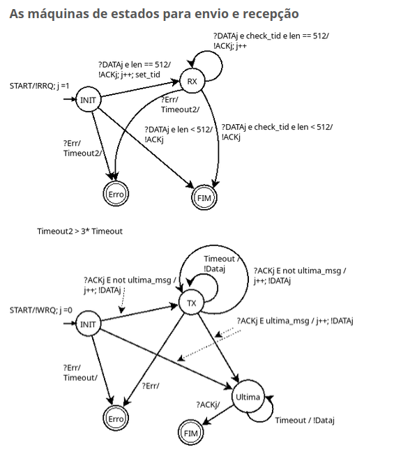

# Projeto1: TFTP

O arquivo de exemplo de utilização da biblioteca é o [menu.py](menu.py), onde são demonstradas as interações que a biblioteca oferece. A biblioteca consiste na classe ClienteTftp, para ser instanciada ela necessita de dois parametros: o endereço ip e a porta do servidor. Após instanciada, o usuário pode utilizar os 2 métodos oferecidos pela biblioteca:

```python
enviar_arquivo(str: caminho) 
```

```python
receber_arquivo(str: caminho)
```

Ambos os métodos tem como parametro uma string contendo o caminho (relativo) do arquivo. 

### Exemplo de utilização do menu.py

Inicialmente, execute um servidor tftp.

Após isso, execute o menu.py, a partir da raíz desse repositório:
```bash
python3 menu.py 
```

### 1 - Entre com o endereço do servidor, assim como será pedido, por exemplo: 127.0.0.1 e tecle enter.

### 2 - Entre com a porta do servidor, assim como será pedido, por exemplo: 6969 e tecle enter.

### 3 - Entre com o caminho do arquivo, assim como será pedido, por exemplo: 
- se tiver escolhido a opção de receber o arquivo, então qual o caminho (no servidor) que está esse arquivo que você quer receber?
- se for enviar o arquivo, então qual o caminho (relativo a partir desse menu.py) que está esse arquivo a ser enviado?

### Vídeo tutorial 
Vídeo de exemplo demonstrativo de utilização da biblioteca:

[Recebimento de Arquivo](https://drive.google.com/file/d/1sBEIzJpw-GlfMbBu_syO3N-EvDsfaDcE/view?usp=sharing) 

[Envio de Arquivo](https://drive.google.com/file/d/1AaEDcbk2ZtZ-jiFr8So7pulUqWtnYGJc/view?usp=sharing)


### Máquina de estado
O projeto foi desenvolvido utilizando como base a máquina de estados (desenvolvida pelo professor):

