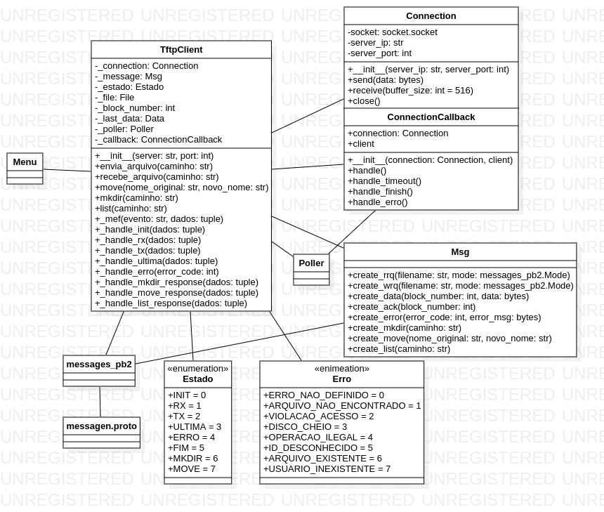
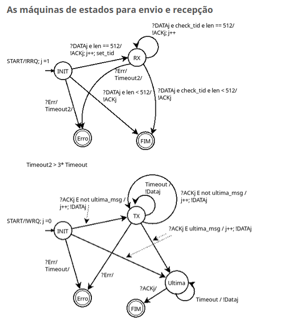

# Relatório de Implementação do Cliente TFTP2

Membros da equipe: 
[David](https://github.com/deividffrederico)  , 
[Gustavo](https://github.com/gugasth) e 
[Wagner](https://github.com/wagnerfloresdossantos) 

## Especificação do Protocolo TFTP2
O protocolo TFTP2 é uma extensão do protocolo TFTP (Trivial File Transfer Protocol), incorporando funcionalidades adicionais para facilitar a manipulação remota de arquivos. A seguir estão as principais especificações e operações do protocolo:

### Operações Suportadas

1. **RRQ (Read Request)**: Solicita a transferência de um arquivo do servidor para o cliente.
2. **WRQ (Write Request)**: Solicita a transferência de um arquivo do cliente para o servidor.
3. **DATA**: Blocos de dados transferidos durante as operações de leitura ou escrita.
4. **ACK (Acknowledgment)**: Reconhece o recebimento de um bloco de dados.
5. **ERROR**: Informa um erro ocorrido durante a operação.
6. **MKDIR**: Cria um novo diretório no servidor.
7. **MOVE**: Renomeia ou remove um arquivo ou diretório.
8. **LIST**: Solicita a listagem de arquivos e diretórios em um diretório especificado.

### Estrutura das Mensagens

As mensagens seguem o formato definido em messages.proto, que especifica os campos obrigatórios para cada operação. Exemplos incluem:
* **RRQ e WRQ**: Contêm o nome do arquivo e o modo de transferência.
* **DATA**: Contém o número do bloco e os dados correspondentes (até 512 bytes).
* **ACK**: Contém o número do bloco reconhecido.
* **ERROR**: Inclui um código de erro e uma mensagem descritiva.

### Novidades no TFTP2

* **MKDIR**: Permite criar novos diretórios no servidor.
* **MOVE**: Permite renomear ou remover arquivos e diretórios.
* **LIST**: Adiciona suporte à listagem de arquivos e diretórios.

## Modelo do Software

### Diagrama de Classes



### Máquina de estado



# Guia de Instalação e Utilização
## Instalação
### Dependências Necessárias
* Python 3.9 ou superior.
* Biblioteca protobuf para manipulação de mensagens binárias.
* Requisitos adicionais especificados no arquivo requirements.txt.

### Passos de Instalação

1. Clone o repositório:
```
git clone https://github.com/mmsobral-croom/projeto-1-um-protocolo-de-transfer-ncia-de-arquivos-gustavo-wagner.git
```
2. Instale as dependências:
 ```
 pip install -r requirements.txt
 ```
## Utilização
1. Inicie o sevidor tftp: 
```
./tftp_server /home/pessoa/endereço_onde_quer_que_os_arquivos_fiquem_armazenados_ou_de_onde_serão_enviados porta
```

2. Execute o script principal:
```
 python menu.py
```
3. Informe o endereço e a porta do servidor TFTP:
```
Qual o endereço do servidor?
localhost
Qual a porta?
6969
```

4. Escolha a operação desejada:
```
1 - Enviar arquivo
2 - Baixar arquivo
3 - Criar diretório (mkdir)
4 - Renomear ou remover arquivo (move)
5 - Listar arquivos/diretórios (list)
```

## Exemplo de Uso
* Para enviar um arquivo:
```
1
Qual o nome do arquivo/diretório?
nome_do_arquivo.extensao
```
obs: o arquivo deve estar no mesmo diretório que menu.py e será tranferido para o diretório instaciado pelo tftp_server


* Para receber um arquivo:
```
2
Qual o nome do arquivo/diretório?
nome_do_arquivo.extensao
```
obs: o arquivo deve estar no mesmo diretório instaciado pelo tftp_server e vai ser enviado para o diretório onde está o manu.py

* Para criar um diretório:
```
3
Qual o nome do arquivo/diretório?
novo_diretorio
```
obs: será criado um novo diretório dentro de onde foi instanciado o tftp_server

* Para renomear um arquivo:
```
4
Qual o nome original do arquivo que você deseja renomear?
antigo.txt
Qual o novo nome que você deseja colocar? (Não digite nada caso queira remover)
novo.txt
```
obs: arquivo precisa estar na pasta onde o tftp_server foi instanciado


* Para listar uma pasta:
```
5
Qual o caminho do diretório que deseja listar?
Camimho desejado para listagem
```