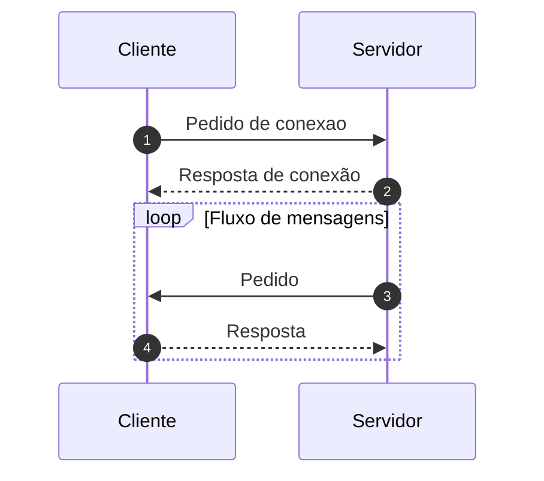
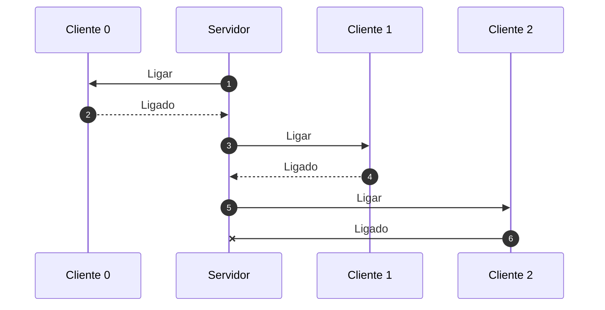

# Diagrama de sequência de bloco

## Conceitual do protocolo

```mermaid
---
    theme: forest
    sequence:
        actorMargin: 100
        boxPadding: 20
        mirrorActors: false
---

sequenceDiagram
    autonumber
    participant C as Cliente
    participant S as Servidor

        C ->> S: Pedido de conexao
        S -->> C: Resposta de conexão

    loop Fluxo de mensagens

        S ->> C: Pedido
        C -->> S: Resposta

    end
    
```

```mermaid
---
    theme: forest
    sequence:
        actorMargin: 100
        boxPadding: 20
        mirrorActors: false
---

sequenceDiagram
    autonumber
    participant C0 as Cliente 0
    participant S as Servidor
    participant C1 as Cliente 1
    participant C2 as Cliente 2

    S->>C0: Ligar
    C0-->>S: Ligado
    S->>C1: Ligar
    C1-->>S: Ligado
    S->>C2: Ligar
    C2-x S: Ligado
    
```