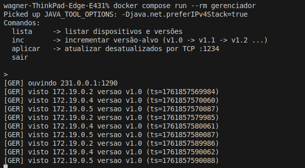
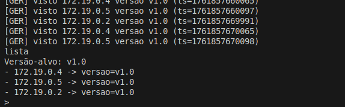
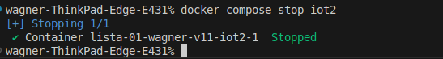
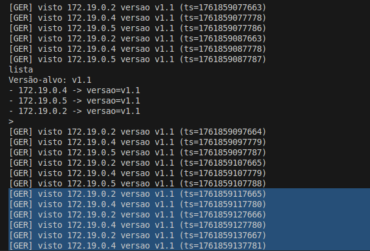
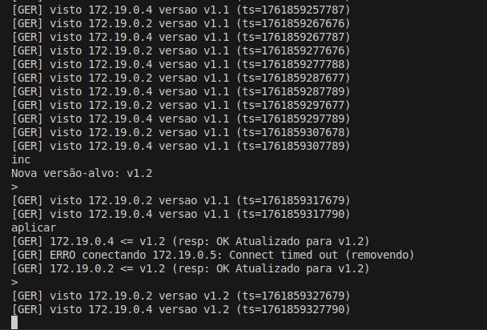

# Projeto – Gerenciador de Atualizações IoT

**Autor**: Wagner Flores dos Santos\
**Disciplina**: Sistemas Distribuídos – Engenharia de Telecomunicações – IFSC/SJ\
**Professor**: Emerson Mello\
**Ano/Semestre**: 2025/2

## Comandos principais

| Ação                         | Comando                               |
| ---------------------------- | ------------------------------------- |
| Construir todas as imagens   | `docker compose build`                |
| Subir todos os contêineres   | `docker compose up -d`                |
| Subir só os IoTs             | `docker compose up -d iot1 iot2 iot3` |
| Executar o Gerenciador (CLI) | `docker compose run --rm gerenciador` |
| Parar todos os contêineres   | `docker compose stop`                 |
| Derrubar (parar) um IoT      | `docker compose stop iot2`            |
| Deletar contêiner            | `docker compose rm -f iot2`           |
| Subir novamente um IoT       | `docker compose up -d iot2`           |
| Remover todos os contêineres | `docker compose down`                 |

## Fluxo do sistema

1. **Cada Dispositivo IoT**:
   - envia, a cada 10 s, uma mensagem UDP multicast para `231.0.0.1:1290` (`UdpAnunciador`);
   - ouve na porta `1234/TCP` para receber atualizações (`TcpServidor` e `TcpAtendedor`);
   - mantém sua versão no objeto `DispositivoEstado`.

2. **O Gerenciador**:
   - escuta o multicast (`UdpOuvinteMulticast`) e mantém uma tabela (`TabelaDispositivos`) com IP → versão;
   - oferece uma CLI (`Cli`) com os comandos `lista`, `inc`, `aplicar`, `sair`;
   - atualiza via TCP (`AtualizadorTcp`) somente os dispositivos desatualizados.

## IoTs iniciando e anunciando (multicast + TCP ouvindo)

## Gerenciador ouvindo + recebendo anúncios (v1.0)

## Interface CLI

`> lista`

`> inc`

`> aplicar`

## Erro de inativo (simulando queda de um IoT)

### Em outro terminal

`docker compose stop iot2`

### Terminal do Gerenciador

`> inc`

`> aplicar`

## Requisitos:

1. O dispositivo IoT deve enviar periodicamente (a cada 10 segundos) uma mensagem UDP de
multicast para o endereço 231.0.0.1:1290, contendo a versão do software que está executando;

Implementado em UdpAnunciador com DatagramSocket.send() e Thread.sleep(10_000).
Exibe no log: [IoT] multicast -> IOT;vX.Y;timestamp.

2. O gerenciador de atualizações deve escutar o endereço UDP de multicast 231.0.0.1:1290 e
processar as mensagens recebidas, atualizando a lista de dispositivos IoT ativos e suas respectivas versões de software;

Implementado em UdpOuvinteMulticast usando MulticastSocket.joinGroup(InetAddress).
Imprime todas as mensagens recebidas a cada 10 s de cada IoT.

3. O gerenciador de atualizações deve fornecer uma interface de linha de comando (CLI) que
permita ao usuário interagir com o sistema;

Implementada na classe Cli, com os comandos lista, inc, aplicar, sair.

4. O gerenciador de atualizações, no processo de atualização do software em um dispositivo
IoT, deve conectar na porta 1234/TCP de cada dispositivo IoT ativo e com versão de software
inferior à versão mais recente, e enviar a nova versão do software. O dispositivo IoT deve então substituir a versão antiga pela nova;

Implementada em AtualizadorTcp e TcpAtendedor: envio da nova versão e resposta "OK Atualizado para vX.Y".

5. Ao tentar conectar a um dispositivo IoT para enviar a atualização, o gerenciador de atualizações pode se deparar com dispositivos que não estão mais ativos. Nesse caso, o gerenciador deve registrar uma mensagem de erro no console, remover o dispositivo da lista de ativos e continuar com o próximo dispositivo da lista;

Implementado no catch (Exception e) do AtualizadorTcp, com remoção da tabela e log de erro.

6. Monte um cenário de teste com pelo menos três dispositivos IoT e um gerenciador de atualizações. Você deve executar cada dispositivo IoT e o gerenciador de atualizações em contêineres Docker separados, mas todos na mesma rede Docker.

Definidos em docker-compose.yml, todos na rede labnet.

7. Ao iniciar, o dispositivo IoT deve aceitar a versão inicial do software como um argumento de linha de comando. Por exemplo, java -jar dispositivo-iot.jar v1.0 inicia o dispositivo
IoT com a versão do software v1.0.

java -jar dispositivo-iot.jar v1.0 ou command: ["./bin/app","v1.0"] no Compose.

8. O gerenciador de atualizações deve sempre iniciar com a versão do software definida como
v1.0 e o usuário pode incrementar essa versão através da interface CLI;

Controlado pelo atributo versaoAlvo no AtualizadorTcp.

9. No arquivo Readme.md você deve apresentar o passo a passo, que deve ser claro o suficiente
para que qualquer pessoa consiga reproduzir o cenário de teste que você montou, para subir
os contêineres e como executar os dispositivos IoT e o gerenciador;

Implementado.

10. No arquivo Readme.md inclua as capturas de tela que demonstrem o funcionamento do sistema, incluindo a saída do gerenciador de atualizações mostrando a lista de dispositivos IoT ativos, as versões do software e as mensagens de erro quando um dispositivo não responde durante a atualização;

Implementado.

11. No arquivo Readme.md você deverá indicar quais funcionalidades atendeu e quais não atendeu.

Todas atendidas.