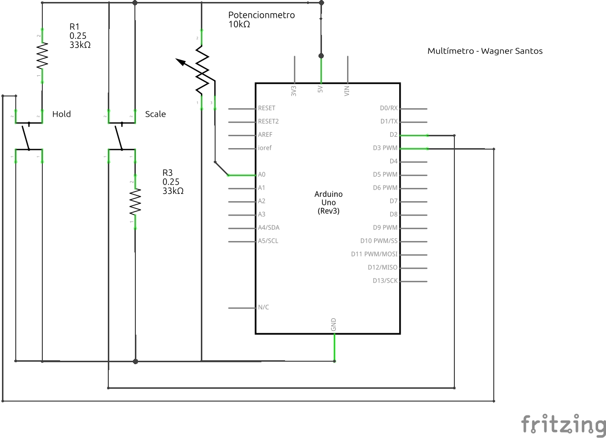

# Sistemas Embarcados - Contato Inicial

Utilize o kit com Arduino entregue a você para implementar um programa com as seguintes especificações.

## Voltímetro Digital

### Resumo

O código implementa um voltímetro digital em um sistema Arduino utilizando o padrão Fila de Funções com a biblioteca cppQueue para gerenciar as tarefas e a biblioteca TimerOne para gerar eventos periódicos. O voltímetro possui dois botões: (Scale) para alternar a escala da tensão medida entre Volts (V) e miliVolts (mV), e (Hold) para segurar ou liberar a atualização da tensão na saída (via monitor Serial).

* cppQueue gerencia a fila de funções, permitindo adicionar e executar tarefas de forma organizada.
* Timer1 chama periodicamente a função timerCallback(), que adiciona tarefas à fila.
* Interrupções tratam os botões Scale e Hold para alterar a escala de tensão e controlar se a saída será atualizada.
* Leitura do ADC é feita com média de 10 leituras para suavizar a tensão lida do potenciômetro.
* Processamento e exibição da tensão são controlados pela fila de funções.

### Esquema Elétrico:

