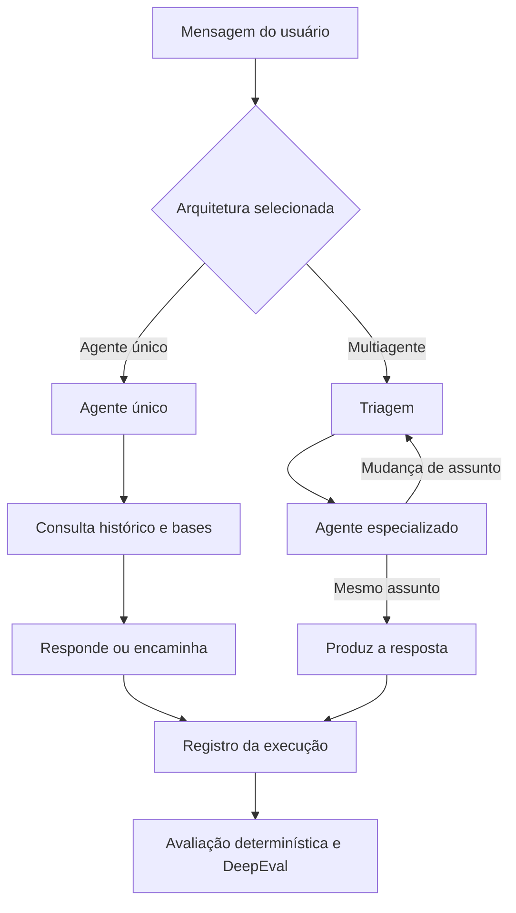
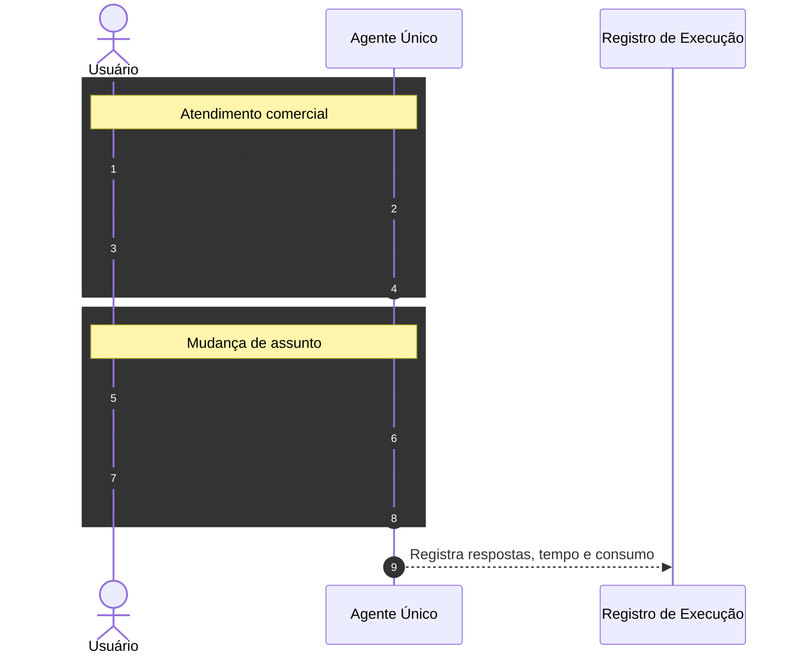
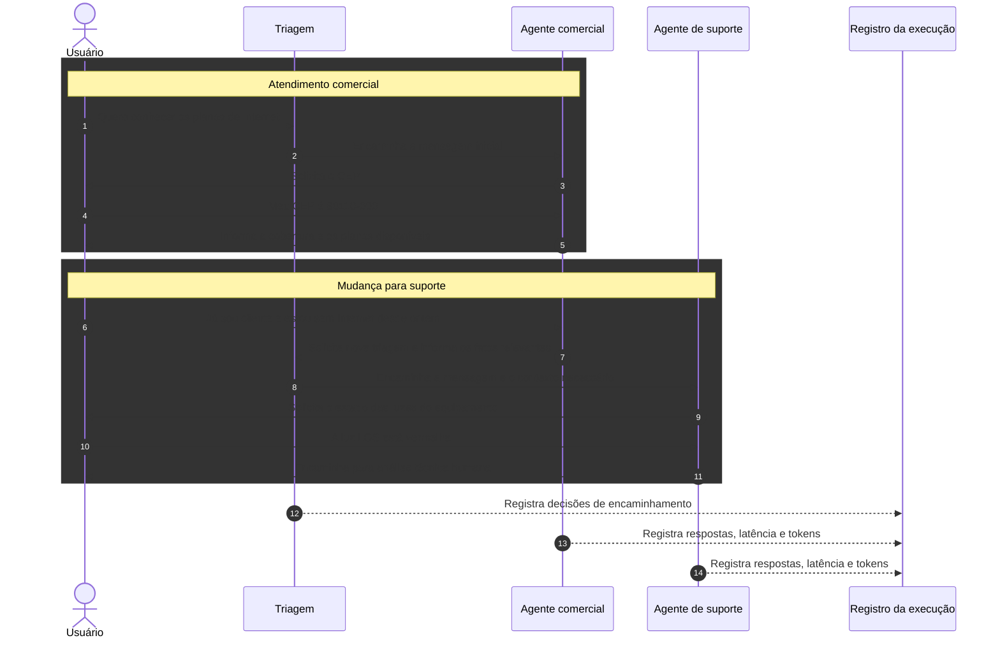

# Protótipo experimental

Este diretório contém o protótipo utilizado para comparar duas arquiteturas de chatbot baseadas em modelos de linguagem de grande escala:

- agente único, responsável por todo o atendimento;
- sistema multiagente, formado por um agente de triagem e agentes especializados.

A versão `0.2` implementa um cenário conversacional piloto com mudança de assunto entre atendimento comercial e suporte técnico. O objetivo desta etapa é verificar a viabilidade da implementação, do registro das execuções e das formas de avaliação propostas para o TCC.

## Estrutura

```text
prototipos/
├── base-conhecimento/
│   ├── base-comercial.md
│   ├── base-comum.md
│   ├── base-suporte.md
│   └── base-triagem.md
├── cenarios/
│   └── cenario-piloto-001.json
├── controles/
│   └── controle-negativo-piloto-001.json
├── diagramas/
│   └── fontes/
├── prompts/
│   ├── agente-unico.md
│   ├── comercial.md
│   ├── suporte.md
│   └── triagem.md
├── resultados/
│   ├── avaliacoes/
│   └── avaliacoes-deepeval/
├── src/
│   ├── agente_unico.py
│   ├── avaliar_deepeval.py
│   ├── avaliar_resultados.py
│   ├── carregador.py
│   ├── cliente_llm.py
│   ├── executar_piloto.py
│   ├── modelos.py
│   └── multiagente.py
├── .env.example
├── requirements.txt
└── requirements-lock.txt
```

## Componentes em Python

| Arquivo | Função no protótipo |
|---|---|
| `src/modelos.py` | Define, com Pydantic, as estruturas usadas nas respostas dos agentes e nos registros de execução. A validação desses modelos reduz a possibilidade de gravar uma saída fora do formato esperado. |
| `src/carregador.py` | Localiza a raiz do protótipo e carrega cenários, bases de conhecimento e prompts. Centraliza a leitura dos arquivos usados pelas duas arquiteturas. |
| `src/cliente_llm.py` | Implementa o acesso ao modelo de linguagem. Possui o cliente da OpenAI, responsável pelas chamadas reais e pelo registro de tokens e latência, e o cliente simulado usado nos testes sem consumo da API. |
| `src/agente_unico.py` | Implementa a arquitetura centralizada. Um único agente recebe a mensagem, consulta o histórico e as bases disponíveis, identifica a intenção, produz a resposta e decide se deve encaminhar o atendimento. |
| `src/multiagente.py` | Implementa a arquitetura multiagente. Controla a triagem inicial, mantém o agente especializado ativo e solicita nova triagem quando há mudança de assunto. Também registra as chamadas e o contexto encaminhado entre os agentes. |
| `src/executar_piloto.py` | É o ponto de entrada do experimento. Recebe o modo de execução e a arquitetura pela linha de comando, carrega o cenário, executa a conversa e salva o resultado em JSON. |
| `src/avaliar_resultados.py` | Aplica os critérios determinísticos do cenário, como intenção esperada, rota entre agentes, encaminhamento final e comportamentos proibidos. Grava os relatórios em `resultados/avaliacoes/`. |
| `src/avaliar_deepeval.py` | Converte os registros para o formato conversacional do DeepEval e executa as métricas de relevância, retenção de conhecimento e conclusão da conversa. Grava os relatórios em `resultados/avaliacoes-deepeval/`. |

## Orquestração do sistema

O mesmo cenário é executado separadamente nas duas arquiteturas. A diferença principal está na distribuição das responsabilidades e na quantidade de chamadas necessárias para concluir o atendimento.



Na arquitetura de agente único, o mesmo componente executa todas as etapas. Na arquitetura multiagente, a triagem seleciona o especialista e volta a ser consultada quando o agente ativo identifica uma mudança de área. Em ambos os casos, a execução registra respostas, intenções, decisões, latência e consumo de tokens.

## Diagramas detalhados

Os diagramas de sequência mostram o processamento do cenário piloto mensagem a mensagem:

- [Fluxo detalhado do agente único](diagramas/fontes/arquitetura-agente-unico.md)

# Fluxo do cenário piloto — arquitetura de agente único



Neste fluxo, o mesmo agente mantém o contexto e trata todas as mensagens da conversa.

- [Fluxo detalhado do sistema multiagente](diagramas/fontes/arquitetura-multiagente.md)


    Nota: Neste fluxo, a triagem define o primeiro destino da conversa. O agente especializado permanece ativo enquanto o assunto pertence à sua área e solicita nova triagem quando identifica uma mudança. Durante o reencaminhamento, somente as informações necessárias são transferidas ao próximo agente.

## Cenário piloto

O cenário contém quatro mensagens do usuário:

1. solicitação de informações sobre planos de Internet;
2. envio do CEP;
3. informação de que já é cliente e está sem conexão desde o dia anterior;
4. informação de que a luz LOS está vermelha.

Esse diálogo permite observar a retenção do contexto, a identificação da intenção, a mudança entre áreas de atendimento e o encaminhamento final para análise técnica humana.

Na arquitetura de agente único, todas as mensagens são processadas pelo mesmo agente. Na arquitetura multiagente, a triagem encaminha inicialmente a conversa ao agente comercial. Quando o usuário informa o problema de conexão, o agente comercial solicita uma nova triagem, que transfere o contexto necessário ao agente de suporte.

## Preparação do ambiente

A partir deste diretório, crie e ative o ambiente virtual:

```bash
python3 -m venv .venv
source .venv/bin/activate
python -m pip install --upgrade pip
python -m pip install -r requirements.txt
```

O arquivo `requirements-lock.txt` registra as versões utilizadas no ambiente em que o piloto foi executado.

## Configuração

Crie o arquivo local de configuração:

```bash
cp .env.example .env
```

Preencha no `.env`:

```dotenv
OPENAI_API_KEY=sua-chave
TCC_OPENAI_MODEL=gpt-4.1-mini
```

O `.env` contém credenciais e não deve ser enviado ao repositório. O `.env.example` permanece versionado sem a chave.

## Validação local

Para verificar a sintaxe dos arquivos Python:

```bash
python -m compileall -q src
```

Para validar os arquivos JSON do cenário e do controle negativo:

```bash
python -m json.tool cenarios/cenario-piloto-001.json > /dev/null
python -m json.tool controles/controle-negativo-piloto-001.json > /dev/null
```

## Execução sem uso da API

O modo `mock` permite validar o fluxo do programa sem consumir créditos:

```bash
python src/executar_piloto.py --mode mock --architecture both
```

Também é possível executar apenas uma arquitetura:

```bash
python src/executar_piloto.py --mode mock --architecture single
python src/executar_piloto.py --mode mock --architecture multi
```

## Execução com a API da OpenAI

Para executar o cenário nas duas arquiteturas:

```bash
python src/executar_piloto.py --mode openai --architecture both
```

Os registros são gravados em `resultados/` e incluem respostas, intenções identificadas, encaminhamentos, chamadas ao modelo, tempo de resposta e quantidade de tokens.

## Avaliação determinística

A avaliação determinística verifica os resultados esperados que podem ser comparados diretamente, como intenção, agente responsável e encaminhamento final:

```bash
python src/avaliar_resultados.py \
  resultados/piloto-001-v0.2-single-openai.json \
  resultados/piloto-001-v0.2-multi-openai.json
```

Os relatórios são gravados em `resultados/avaliacoes/`.

## Avaliação com DeepEval

A avaliação conversacional utiliza as métricas de relevância das respostas, retenção do conhecimento e conclusão da conversa:

```bash
python src/avaliar_deepeval.py \
  resultados/piloto-001-v0.2-single-openai.json \
  resultados/piloto-001-v0.2-multi-openai.json
```

O limiar padrão é `0.5` e possui caráter exploratório nesta etapa. Outro valor pode ser informado:

```bash
python src/avaliar_deepeval.py \
  --threshold 0.8 \
  resultados/piloto-001-v0.2-single-openai.json \
  resultados/piloto-001-v0.2-multi-openai.json
```

A execução do DeepEval utiliza um modelo avaliador e pode consumir créditos da API.

## Controle negativo

O controle negativo contém respostas alteradas intencionalmente para verificar se as métricas conseguem distinguir uma conversa inadequada:

```bash
python src/avaliar_deepeval.py \
  controles/controle-negativo-piloto-001.json
```

Esse teste não representa uma terceira arquitetura. Ele serve somente para verificar a sensibilidade do procedimento de avaliação.

## Métricas previstas para a comparação

Os testes do protótipo confirmaram que é possível registrar e avaliar medidas de qualidade, roteamento e eficiência. As mesmas métricas deverão ser aplicadas às duas arquiteturas, utilizando o mesmo modelo, os mesmos parâmetros, as mesmas bases de informação e os mesmos cenários.

| Dimensão | Métrica | Forma de avaliação | Interpretação |
|---|---|---|---|
| Qualidade | Correção e relevância da resposta | Métrica conversacional do DeepEval e critérios esperados do cenário | Valores maiores indicam respostas mais adequadas à solicitação. |
| Qualidade | Retenção do contexto | `KnowledgeRetentionMetric` do DeepEval | Valores maiores indicam melhor uso das informações apresentadas nos turnos anteriores. |
| Qualidade | Conclusão da conversa | `ConversationCompletenessMetric` do DeepEval | Valores maiores indicam que os objetivos previstos no cenário foram atendidos. |
| Intenção | Acerto da intenção | Comparação determinística entre a intenção produzida e a esperada em cada turno | Pode ser apresentado como acertos por cenário e taxa de acerto no conjunto de testes. |
| Roteamento | Precisão do encaminhamento | Comparação entre o agente acionado e a rota esperada | Valores maiores indicam menos encaminhamentos incorretos. |
| Roteamento | Trocas de agente | Contagem das mudanças de agente durante a conversa | Permite identificar transferências necessárias e transferências adicionais. |
| Roteamento | Encaminhamento final | Verificação do destino final esperado, inclusive atendimento humano | Indica se a conversa terminou no agente ou setor adequado. |
| Eficiência | Tempo de resposta | Soma e distribuição da latência registrada nas chamadas ao modelo, em milissegundos | Valores menores indicam menor tempo de processamento. |
| Eficiência | Consumo de tokens | Tokens de entrada, saída e total registrados pela API | Valores menores indicam menor uso do modelo para o mesmo cenário. |
| Eficiência | Número de chamadas ao modelo | Contagem das chamadas realizadas por conversa | Evidencia o custo adicional de triagem, especialização e novas decisões. |
| Confiabilidade | Comportamentos proibidos | Verificação determinística de respostas ou ações que não deveriam ocorrer | A ocorrência indica falha, ainda que a resposta final pareça adequada. |
| Repetibilidade | Variação entre execuções | Comparação das métricas obtidas em repetições do mesmo cenário | Permite observar a variabilidade do modelo e apresentar mediana e dispersão. |

O número de turnos não será usado isoladamente no cenário piloto, pois as quatro mensagens do usuário já estão definidas no arquivo de teste. Essa medida poderá ser utilizada posteriormente em cenários nos quais a arquitetura determine quantas interações são necessárias para concluir a tarefa.

O consumo de tokens será mantido como medida principal de uso do modelo. Uma estimativa financeira poderá ser calculada como informação complementar, registrando o modelo e os preços vigentes na data do experimento.

## Resultados preliminares

### Avaliação do atendimento

| Execução avaliada | Intenções corretas | Rotas corretas | Relevância | Retenção do contexto | Conclusão da conversa |
|---|---:|---:|---:|---:|---:|
| Agente único | 4/4 | 4/4 | 1,00 | 1,00 | 1,00 |
| Multiagente | 4/4 | 4/4 | 1,00 | 1,00 | 1,00 |
| Controle negativo | Não se aplica | Não se aplica | 0,25 | 0,75 | 0,00 |

As duas arquiteturas atenderam aos critérios previstos para o cenário piloto. Como ambas obtiveram os mesmos valores de qualidade, esta execução isolada não demonstra vantagem de uma arquitetura sobre a outra.

O controle negativo foi o resultado mais importante para validar o procedimento de avaliação. As respostas foram alteradas intencionalmente e produziram redução clara na relevância e na conclusão da conversa. A retenção do contexto permaneceu em `0,75`, acima do limiar exploratório de `0,5`, indicando que essa métrica isolada não é suficiente para reprovar uma conversa inadequada. Por esse motivo, a análise deverá combinar métricas conversacionais e critérios determinísticos.

### Recursos utilizados

| Arquitetura | Chamadas ao modelo | Tokens de entrada | Tokens de saída | Tokens totais | Latência acumulada |
|---|---:|---:|---:|---:|---:|
| Agente único | 4 | 5.216 | 309 | 5.525 | 14.737,418 ms |
| Multiagente | 7 | 7.461 | 415 | 7.876 | 9.419,820 ms |

O sistema multiagente realizou três chamadas adicionais e consumiu 2.351 tokens a mais. Apesar disso, apresentou menor latência acumulada nesta execução. Esse resultado aparentemente contraditório mostra que a latência não depende somente da quantidade de chamadas: ela também é influenciada pelo tempo de resposta da API, pelo tamanho das entradas e pela variação própria do serviço. Assim, uma única execução não é suficiente para comparar o tempo das arquiteturas.

### Repetições do experimento

Com base no comportamento observado no piloto, propõe-se executar cada cenário cinco vezes em cada arquitetura. As repetições deverão utilizar o mesmo modelo, os mesmos parâmetros, as mesmas bases e o mesmo conjunto de mensagens. Cada execução será independente e terá seus resultados registrados separadamente.

As cinco repetições não eliminam a variabilidade nem constituem, por si só, uma comprovação estatística. Elas formam uma quantidade inicial viável para observar se os resultados permanecem estáveis e reduzir a influência de uma chamada excepcionalmente rápida ou lenta. Para a latência, serão apresentados pelo menos a mediana, o valor mínimo, o valor máximo e uma medida de dispersão. Para intenções, rotas e conclusão, será apresentada a frequência de acertos nas repetições.

O número definitivo de repetições ainda deverá ser confirmado após a execução de mais cenários e a análise da variabilidade encontrada. Caso cinco execuções apresentem grande dispersão, será necessário ampliar a amostra.

## Limitações desta versão

Esta versão utiliza somente um cenário piloto, com as áreas comercial e de suporte. Os resultados servem para validar o funcionamento do protótipo e do procedimento de avaliação, mas não constituem o experimento final do TCC.

Ainda deverão ser definidos e validados:

- o conjunto completo de cenários conversacionais;
- as demais áreas de atendimento;
- o número de repetições por cenário;
- os parâmetros de geração do modelo;
- o limiar das métricas conversacionais;
- a forma de apresentação das medidas de tempo e consumo;
- os critérios para análise comparativa das arquiteturas.
