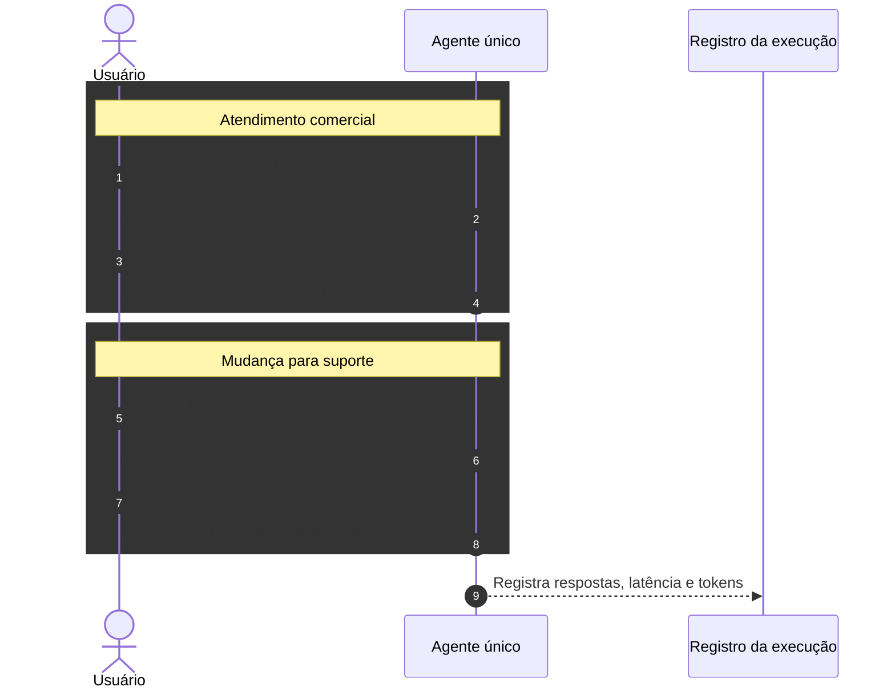

```mermaid
sequenceDiagram
    autonumber

    actor U as Usuário
    participant A as Agente único
    participant R as Registro da execução

    rect
        Note over U,A: Atendimento comercial
        U->>A: Quero conhecer os planos de Internet
        A->>U: Solicita o CEP
        U->>A: Meu CEP é 88110-000
        A->>U: Informa a cobertura e os planos disponíveis
    end

    rect
        Note over U,A: Mudança para suporte
        U->>A: Já sou cliente e estou sem Internet desde ontem
        A->>U: Solicita o estado das luzes do equipamento
        U->>A: A luz LOS está vermelha
        A->>U: Encaminha para análise técnica humana
    end

    A-->>R: Registra respostas, latência e tokens
```
    Nota: Neste fluxo, o mesmo agente mantém o histórico da conversa, identifica a mudança de assunto e executa as etapas comerciais e técnicas sem transferência entre agentes.