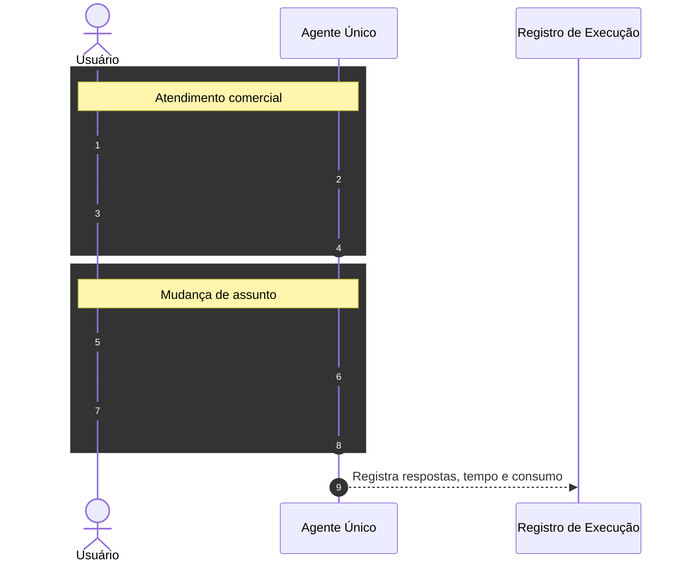

# Fluxo do cenário piloto — arquitetura de agente único

```mermaid
sequenceDiagram
    autonumber

    actor U as Usuário
    participant A as Agente Único
    participant R as Registro de Execução

    rect 
        Note over U,A: Atendimento comercial
        U->>A: Quero conhecer os planos de Internet
        A->>U: Solicita o CEP
        U->>A: Meu CEP é 88110-000
        A->>U: Continua o atendimento comercial
    end

    rect
        Note over U,A: Mudança de assunto
        U->>A: Já sou cliente e estou sem Internet
        A->>U: Inicia o atendimento técnico
        U->>A: A luz LOS está vermelha
        A->>U: Informa o procedimento previsto
    end

    A-->>R: Registra respostas, tempo e consumo
```

Neste fluxo, o mesmo agente mantém o contexto e trata todas as mensagens da conversa.
