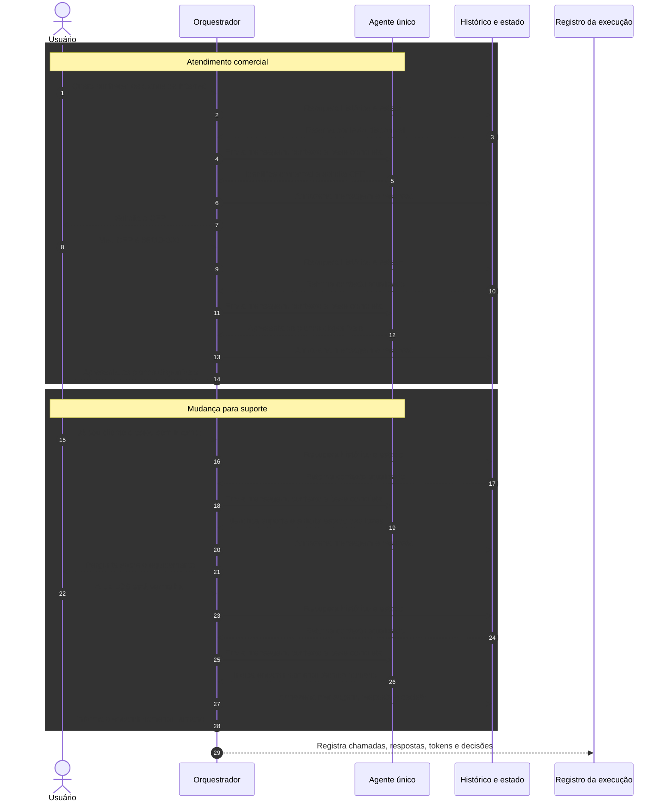

```mermaid
sequenceDiagram
    autonumber

    actor U as Usuário
    participant O as Orquestrador
    participant A as Agente único
    participant H as Histórico e estado
    participant R as Registro da execução

    rect
        Note over U,A: Atendimento comercial
        U->>O: Quero conhecer os planos de Internet
        O->>H: Recupera histórico e estado
        H-->>O: Retorna contexto disponível
        O->>A: Envia mensagem, contexto e base completa
        A-->>O: Identifica comercial e solicita CEP
        O->>H: Armazena mensagem e resposta
        O-->>U: Solicita o CEP

        U->>O: Meu CEP é 88110-000
        O->>H: Recupera histórico e estado
        H-->>O: Retorna contexto atualizado
        O->>A: Envia mensagem, contexto e base completa
        A-->>O: Apresenta os planos disponíveis
        O->>H: Armazena mensagem e resposta
        O-->>U: Apresenta os planos disponíveis
    end

    rect
        Note over U,A: Mudança para suporte
        U->>O: Já sou cliente e estou sem Internet
        O->>H: Recupera histórico e estado
        H-->>O: Retorna contexto atualizado
        O->>A: Envia mensagem, contexto e base completa
        A-->>O: Identifica suporte e solicita estado das luzes
        O->>H: Armazena mensagem e resposta
        O-->>U: Pergunta sobre o equipamento

        U->>O: A luz LOS está vermelha
        O->>H: Recupera histórico e estado
        H-->>O: Retorna contexto atualizado
        O->>A: Envia mensagem, contexto e base completa
        A-->>O: Indica encaminhamento técnico humano
        O->>H: Armazena mensagem, resposta e decisão
        O-->>U: Informa o encaminhamento humano
    end

    O-->>R: Registra chamadas, respostas, tokens e decisões
```
