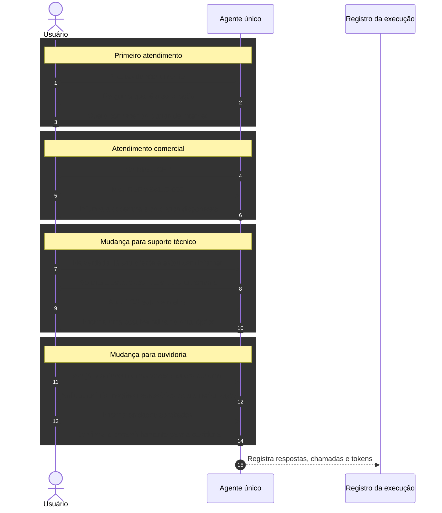

```mermaid
sequenceDiagram
    autonumber

    actor U as Usuário
    participant A as Agente único
    participant R as Registro da execução

    rect
        Note over U,A: Primeiro atendimento
        U->>A: Preciso de atendimento
        A->>U: Pergunta qual é a solicitação
        U->>A: Quero conhecer os planos de Internet
    end

    rect
        Note over U,A: Atendimento comercial
        A->>U: Solicita o CEP
        U->>A: Meu CEP é 88110-000
        A->>U: Informa a cobertura e os planos disponíveis
    end

    rect
        Note over U,A: Mudança para suporte técnico
        U->>A: Na verdade, já sou cliente e estou sem Internet
        A->>U: Solicita o estado das luzes do equipamento
        U->>A: A luz LOS está vermelha
        A->>U: Informa uma possível falha no sinal óptico
    end

    rect
        Note over U,A: Mudança para ouvidoria
        U->>A: Isso já aconteceu outras vezes e quero reclamar
        A->>U: Solicita as informações necessárias para a reclamação
        U->>A: Informa os dados solicitados
        A->>U: Confirma o encaminhamento para a ouvidoria
    end

    A-->>R: Registra respostas, chamadas e tokens
```
