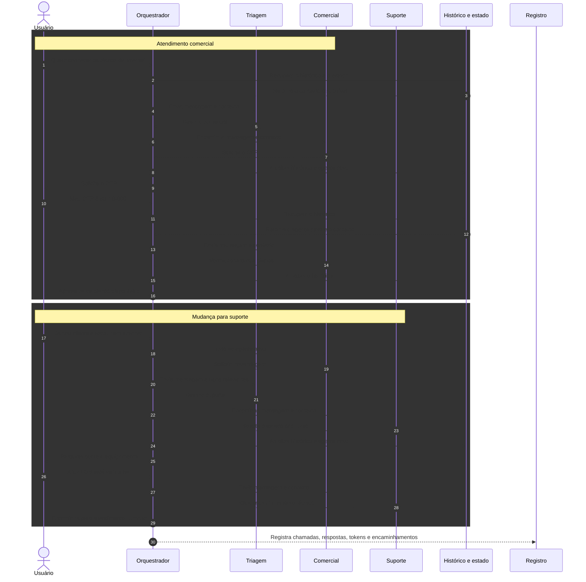

```mermaid
sequenceDiagram
    autonumber

    actor U as Usuário
    participant O as Orquestrador
    participant T as Triagem
    participant C as Comercial
    participant S as Suporte
    participant H as Histórico e estado
    participant R as Registro

    rect
        Note over U,C: Atendimento comercial
        U->>O: Quero conhecer os planos de Internet
        O->>H: Recupera o histórico e o estado
        H-->>O: Retorna o contexto disponível
        O->>T: Envia mensagem e contexto
        T-->>O: Destino comercial
        O->>C: Encaminha mensagem e contexto
        C-->>O: Solicita o CEP
        O->>H: Atualiza histórico e agente ativo
        O-->>U: Solicita o CEP

        U->>O: Meu CEP é 88110-000
        O->>H: Recupera o histórico
        H-->>O: Retorna o agente ativo e o contexto
        O->>C: Envia mensagem e contexto
        C-->>O: Informa cobertura e planos
        O->>H: Atualiza o histórico
        O-->>U: Apresenta os planos disponíveis
    end

    rect
        Note over U,S: Mudança para suporte
        U->>O: Já sou cliente e estou sem Internet
        O->>C: Envia ao agente ativo
        C-->>O: Solicita nova triagem
        O->>T: Envia mensagem e fatos relevantes
        T-->>O: Destino suporte
        O->>S: Encaminha mensagem e contexto
        S-->>O: Solicita o estado das luzes
        O->>H: Atualiza histórico e agente ativo
        O-->>U: Pergunta sobre o equipamento

        U->>O: A luz LOS está vermelha
        O->>S: Envia mensagem e contexto
        S-->>O: Indica encaminhamento técnico
        O-->>U: Encaminha para atendimento humano
    end

    O-->>R: Registra chamadas, respostas, tokens e encaminhamentos
```  