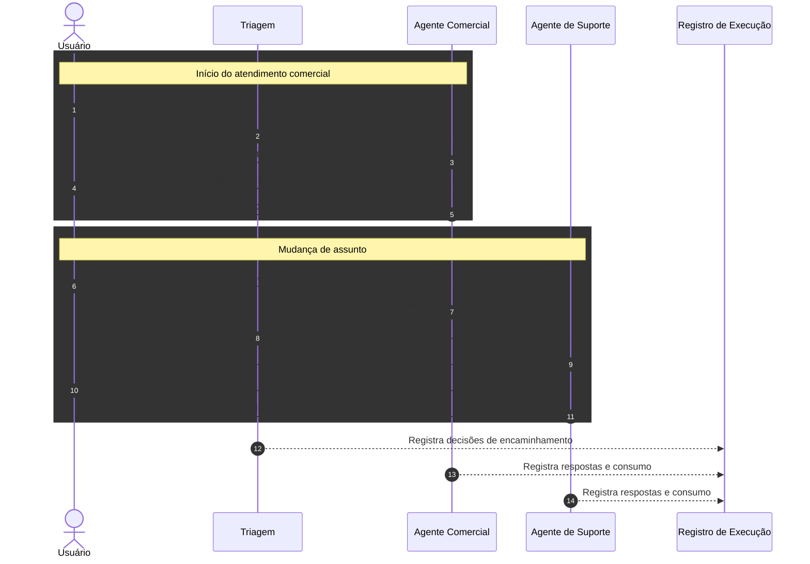

# Fluxo do cenário piloto — arquitetura multiagente

Neste fluxo, a triagem define o primeiro destino. O agente especializado mantém a conversa e solicita nova triagem somente quando identifica mudança de assunto.
