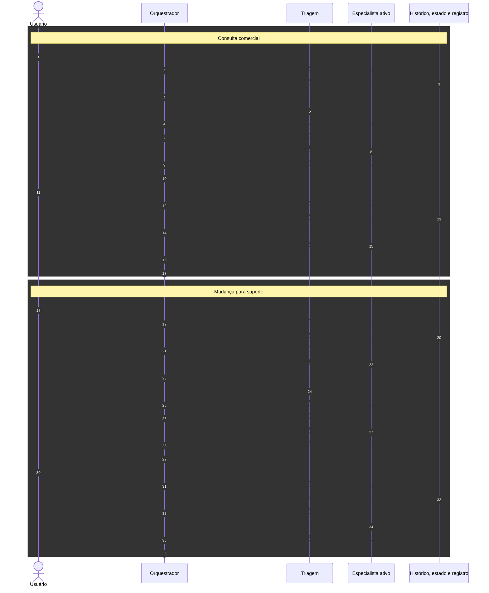

```mermaid
sequenceDiagram
    autonumber

    actor U as Usuário
    participant O as Orquestrador
    participant T as Triagem
    participant E as Especialista ativo
    participant H as Histórico, estado e registro

    rect
        Note over U,H: Consulta comercial
        U->>O: Quero conhecer os planos de Internet
        O->>H: Consulta histórico, fatos e agente ativo
        H-->>O: Contexto inicial, nenhum especialista ativo
        O->>T: Instruções, base comum e de triagem, contexto e mensagem
        T-->>O: Destino comercial e contexto para continuidade
        O->>H: Define comercial como agente ativo
        O->>E: Instruções, base comum e comercial, contexto e mensagem
        E-->>O: Resposta solicitando CEP, ação e fatos atualizados
        O->>H: Atualiza histórico e fatos, registra chamadas
        O-->>U: Solicita o CEP

        U->>O: Meu CEP é 88110-000
        O->>H: Consulta histórico, fatos e agente ativo
        H-->>O: Contexto atualizado, comercial ativo
        O->>E: Instruções, base comum e comercial, contexto e mensagem
        E-->>O: Resposta com planos, ação e fatos atualizados
        O->>H: Atualiza histórico e fatos, registra chamada
        O-->>U: Apresenta os planos disponíveis
    end

    rect
        Note over U,H: Mudança para suporte
        U->>O: Já sou cliente e estou sem Internet
        O->>H: Consulta histórico, fatos e agente ativo
        H-->>O: Contexto atualizado, comercial ativo
        O->>E: Instruções, base comum e comercial, contexto e mensagem
        E-->>O: request_reroute, response=null, handoff_target=null
        O->>T: Instruções, bases de triagem, contexto, mensagem e solicitação
        T-->>O: Destino suporte e contexto para continuidade
        O->>H: Define suporte como agente ativo
        O->>E: Instruções, base comum e suporte, contexto e mesma mensagem
        E-->>O: Resposta sobre luzes, ação e fatos atualizados
        O->>H: Atualiza histórico e fatos, registra chamadas
        O-->>U: Pergunta sobre as luzes da ONT

        U->>O: A luz LOS está vermelha
        O->>H: Consulta histórico, fatos e agente ativo
        H-->>O: Contexto atualizado, suporte ativo
        O->>E: Instruções, base comum e suporte, contexto e mensagem
        E-->>O: Resposta, handoff_human, technical_human e fatos
        O->>H: Atualiza histórico e fatos, registra chamada e decisão
        O-->>U: Informa necessidade de atendimento técnico humano
    end
```

