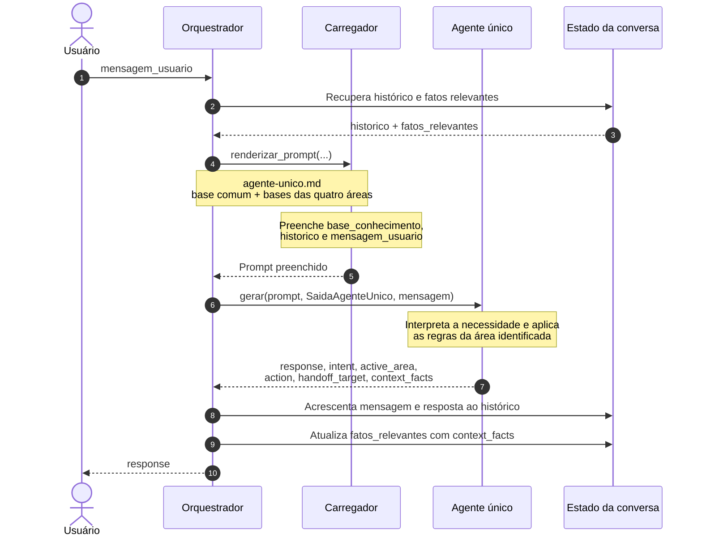

```mermaid
sequenceDiagram
    autonumber
    actor U as Usuário
    participant O as Orquestrador
    participant C as Carregador
    participant A as Agente único
    participant R as Estado da conversa

    U->>O: mensagem_usuario
    O->>R: Recupera histórico e fatos relevantes
    R-->>O: historico + fatos_relevantes

    O->>C: renderizar_prompt(...)
    Note over O,C: agente-unico.md<br/>base comum + bases das quatro áreas
    Note over C: Preenche base_conhecimento,<br/>historico e mensagem_usuario
    C-->>O: Prompt preenchido

    O->>A: gerar(prompt, SaidaAgenteUnico, mensagem)
    Note over A: Interpreta a necessidade e aplica<br/>as regras da área identificada
    A-->>O: response, intent, active_area,<br/>action, handoff_target, context_facts

    O->>R: Acrescenta mensagem e resposta ao histórico
    O->>R: Atualiza fatos_relevantes com context_facts
    O-->>U: response
```
***Nota***: Neste fluxo, o mesmo agente recebe a base comum e as quatro bases especializadas. active_area` registra a área identificada; não representa uma troca de agente.    
   