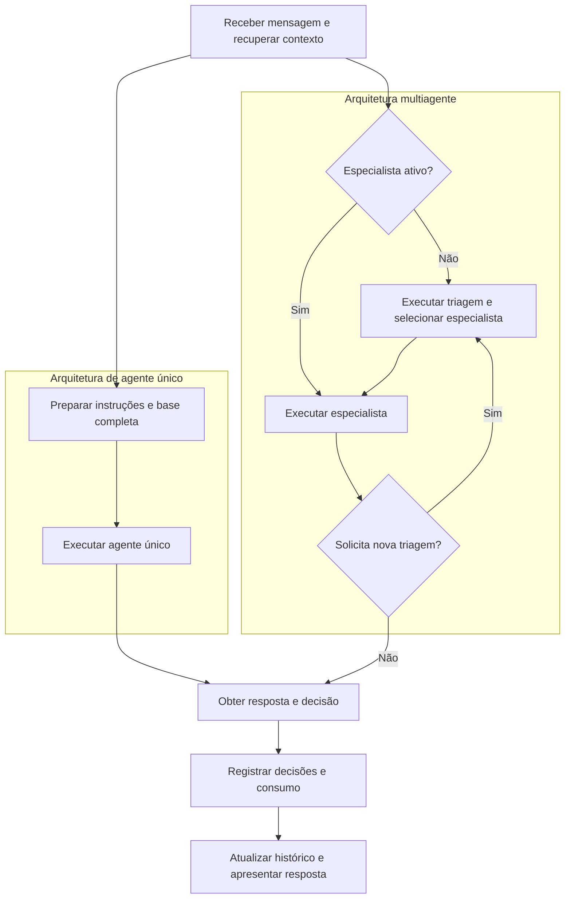

```mermaid
flowchart TB
    A["Receber mensagem e recuperar contexto"]

    subgraph AU["Arquitetura de agente único"]
        direction TB
        B["Preparar instruções e base completa"]
        C["Executar agente único"]
        B --> C
    end

    subgraph MA["Arquitetura multiagente"]
        direction TB
        D{"Especialista ativo?"}
        E["Executar triagem e selecionar especialista"]
        F["Executar especialista"]
        G{"Solicita nova triagem?"}

        D -- Não --> E
        D -- Sim --> F
        E --> F
        F --> G
        G -- Sim --> E
    end

    A --> B
    A --> D

    C --> H["Obter resposta e decisão"]
    G -- Não --> H

    H --> I["Registrar decisões e consumo"]
    I --> J["Atualizar histórico e apresentar resposta"]
```
