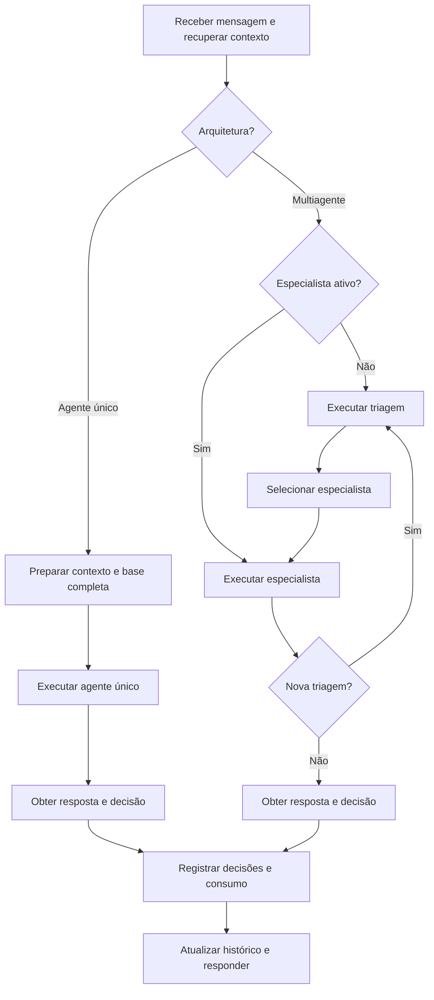

```mermaid
flowchart TD
    A["Receber mensagem e recuperar contexto"]
    A --> B{"Arquitetura?"}

    B -- Agente único --> C["Preparar contexto e base completa"]
    C --> D["Executar agente único"]
    D --> E["Obter resposta e decisão"]

    B -- Multiagente --> F{"Especialista ativo?"}
    F -- Não --> G["Executar triagem"]
    G --> H["Selecionar especialista"]
    F -- Sim --> I["Executar especialista"]
    H --> I
    I --> J{"Nova triagem?"}
    J -- Sim --> G
    J -- Não --> K["Obter resposta e decisão"]

    E --> L["Registrar decisões e consumo"]
    K --> L
    L --> M["Atualizar histórico e responder"]
```
