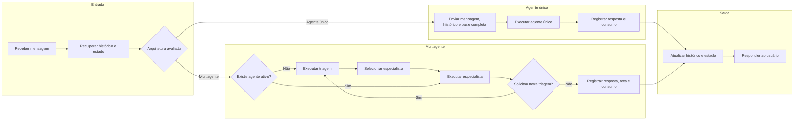

```mermaid
flowchart LR
    subgraph EN["Entrada"]
        direction TB
        A["Receber mensagem"] --> B["Recuperar histórico e estado"]
        B --> C{"Arquitetura avaliada"}
    end

    subgraph AU["Agente único"]
        direction TB
        D["Enviar mensagem, histórico e base completa"]
        D --> E["Executar agente único"]
        E --> F["Registrar resposta e consumo"]
    end

    subgraph MA["Multiagente"]
        direction TB
        G{"Existe agente ativo?"}
        G -- Não --> H["Executar triagem"]
        H --> I["Selecionar especialista"]
        I --> J["Executar especialista"]
        G -- Sim --> J
        J --> K{"Solicitou nova triagem?"}
        K -- Sim --> H
        K -- Não --> L["Registrar resposta, rota e consumo"]
    end

    subgraph SA["Saída"]
        direction TB
        M["Atualizar histórico e estado"]
        M --> N["Responder ao usuário"]
    end

    C -- Agente único --> D
    C -- Multiagente --> G
    F --> M
    L --> M
```